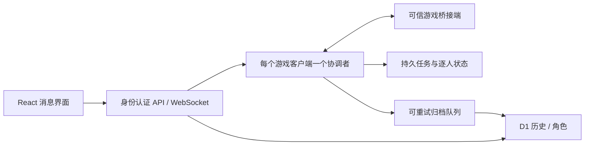

# 实时消息代码审查（2026-09-04）

本次依据当前工作树审查了 MQTT 生命周期、消息识别与历史同步、客户端占用、私聊与群发、未读、角色目录与在线状态、消息渲染以及 AI 工具的调用边界。结论：现有 React 19 / TanStack Start / D1 可以继续使用，优先解决消息可靠性与服务端执行权限，其次处理长历史渲染和缓存。12 万角色本身不要求更换数据库或前端框架。

本次修复与下面的后续架构建议是不同状态。表中“待改造”仍是当前代码的限制，不能理解为已经解决。

## 已修复并验证

| 问题 | 触发与影响 | 修复及验证 |
| --- | --- | --- |
| MQTT 异步连接竞态 | MQTT 模块还未加载完成时重复连接、重连或卸载，旧调用仍可能创建连接；旧连接回调可以覆盖新连接状态 | 连接代次与同步防重入；断开/卸载使旧导入失效；所有主要回调检查当前连接。浏览器复现慢导入、重复连接、重连、卸载和旧回调 |
| 记住的客户端被过早清空 | A2 的发现响应先于记住的 A1 到达，之前立即清空 A1 | 区分“尚未发现”与“发现后失联”；乱序发现测试通过 |
| 停止群发仍继续读取所有角色 | 群发取消信号没有传入 loadAll，12 万角色仍可能继续分页读取 | 信号贯穿收件人读取、分页和等待；取消后检查信号；浏览器确认请求被取消且没有发送 |
| 群发使用旧占用状态 | 循环捕获开始时的客户端和权限，页面切换、占用变化或掉线后仍可继续 | 页面、客户端、占用代次、连接状态变化及卸载时取消；退出登录先取消。验证第一条发送后失去占用，第二条不发送。服务端强制执行权限仍见下表 |
| 停止按钮变回提交按钮后重新触发表单 | 快速取消时 React 复用同一个 button；默认点击行为可能在节点变成 submit 后启动另一轮 | 停止点击 preventDefault，开始/停止按钮使用不同 key；此问题是在取消测试中实际复现并修复 |
| 历史续页竞态与无限等待 | 连续触发加载更早消息可能重复请求；切换角色不能取消旧续页 | 抽出 useChatHistory：单请求、切换取消、15 秒超时、按数据库 ID 合并、首屏失败可重试。验证双击只发一个请求、旧请求取消、迟到消息不串角色 |
| 输入法回车误发送 | 中文输入法确认候选词的 Enter 同时触发私聊、群发或 AI 提交 | 所有四处 Enter 提交检查 isComposing；浏览器确认私聊和群发均不误发，普通 Enter 仍可提交 |
| 后台消息自动已读 | 消息页留在后台，选中角色的新消息仍立即被标记已读 | 只在标签页可见时标记；visibilitychange 使用 React useEffectEvent 读取当前角色和消息；测试后台未读保留，返回可见后再标记 |

群发防重入也改用同步 ref，避免依赖尚未提交的 React state；群发期间 AI/其他入口不能插入一条单独私聊。角色分页采用 AbortSignal.any 合并主动取消与超时。MQTT 禁止将 QoS 0 命令悄悄排队到重连后执行。

## 仍需优先改造的部分

| 优先级 / 状态 | 当前代码证据 | 影响与建议 |
| --- | --- | --- |
| P1 待改造：保存队列依赖 UI 缓存 | use-aion-console.ts 的 addMessage 仅保留最近 500 条；index.tsx 的 syncMessages 只遍历这个数组 | 保存接口持续失败、页面关闭，或一次渲染前消息突发超过缓存窗口时，未落库消息可能从后续重试中消失。界面缓存不能承担可靠收件箱。优先让可信游戏桥接服务先持久化事件、再推送网页；过渡方案是按账号隔离的 IndexedDB outbox，成功确认后删除 |
| P1 待改造：保存错误被当成处理完成 | syncMessages 遇到 HTTP 400/404 就 markProcessed；HTTP 200 缺少 conversations 数组也按全部成功处理；只按条数分包 | 非法单条可以导致整个批次被忽略；返回体异常也可能不再重试。100 条长消息及 raw 可以超过 API 的 512 KiB 限制。需要按 UTF-8 字节分包、严格逐项确认、异常条目隔离与可见的同步状态，区分可重试、永久失败和未确认，不能把失败叫成功 |
| P1 待改造：锁不是发送端的权限边界 | sendCommand 在浏览器直接向 MQTT 发布；/api/client-locks 的 offline 分支只确认登录；releaseOfflineClientLock 的 DELETE 没有 user_key 或可信桥接服务身份条件 | 本次只是让正常界面及时停止旧循环。任意已登录调用者目前可以通过 offline 路径清除其他账号的锁，现有 test-client-locks 还明确覆盖了这种行为。应改为可信桥接服务报告离线，所有实际发送必须经过服务端校验 owner + 占用代次；网页观察到心跳缺失不能作为释放他人锁的权威证明 |
| P1 待改造：命令投递与游戏执行未形成可靠状态机 | sendCommand 调用 publish 后立即返回 true；群发 sentCount 按 true 累加，未等游戏回执；连接 clean:true，未配置持久会话 | “命令已发送”不等于游戏成功。需要 queued → accepted → succeeded / failed / unknown 状态，使用 requestId 和游戏 GUID；断线后不能凭超时自动重发，以免真实重复发送。切换 QoS 1 也不能单独实现业务幂等 |
| P2 待改造：大群发仍由浏览器执行 | sendWhisperToAll 先加载全部收件人，再在浏览器逐条等待；群发取消现已修复 | 内存和启动时间随目标数增加；浏览器休眠/关闭会中断。改为服务端持久化任务，保存筛选快照、游标、取消状态、进度及逐人回执；每客户端串行，不能让队列重试乱序或重复发送 |
| P2 待优化：长会话和长期运行开销 | chronologicalMessages.map 全量渲染已加载历史；readMessageIds、persistedMessageIds 不回收；syncAgents 每轮生成新数组；两个目录 hook 都请求 directory=1 | 长会话 DOM 和会话内集合增长，心跳也触发上层更新。对可变高度消息使用 TanStack Virtual，已读改为持久游标/有限缓存，共享目录查询，稳定不变的在线客户端快照。现有固定高度角色虚拟列表已通过 12 万数据验证，可以保留 |
| P2 待优化：任意子串搜索扫描 | characters.server.ts 用 instr(character_name, ?) / instr(character_id, ?) | 当前普通 B-tree 索引不能解决任意包含搜索。先观察真实 SQL rows_read/延迟；保留精确 ID 查询，评估前缀搜索或适合中文的检索索引。不要直接换 FTS 后改变用户原来的包含匹配语义 |

后续进展：保存错误处理、按字节拆包及重复目录请求已在 [费用审查](cloudflare-cost-review-2026-09-04.md) 中修复。AI 目标范围隔离、历史状态和续页重试已在 [第二轮审查](realtime-message-review-round2-2026-09-04.md) 中修复并验证；上表保留第一轮审查时的证据，当前状态以对应后续报告为准。

默认 MQTT 设置为公共 broker，代码中也没有 MQTT 用户鉴权参数。这是默认配置的审查结果，不代表已核实生产浏览器正在使用哪个 broker；正式方案应使用私有 ACL 或可信网关，不能把 topic 难猜当作权限控制。

## 技术选择与实施顺序

| 选择 | 如何用于当前项目 | 本次状态 |
| --- | --- | --- |
| React 19 useEffectEvent | 可见性监听读取最新 props/state，避免旧闭包；仅用于 effect 建立的事件处理，不用于普通按钮回调 | 已使用。见 [React 官方文档](https://react.dev/reference/react/useEffectEvent) |
| AbortSignal.any + timeout | 将取消、离开页面及请求超时统一接入 fetch；每次请求独立信号 | 已使用。见 [MDN](https://developer.mozilla.org/en-US/docs/Web/API/AbortSignal/any_static) |
| TanStack Query v5 | 下一阶段统一目录、角色和历史的缓存键、续页、取消与刷新；查询函数必须把 signal 交给 fetch，缓存键包含用户及完整筛选条件 | 推荐渐进迁移，未添加依赖。见 [查询取消](https://tanstack.com/query/latest/docs/framework/react/guides/query-cancellation) |
| TanStack Virtual v3 | 对消息气泡用动态测量，处理不同文字长度、加载更早记录时的滚动锚点；固定高度角色列表可继续沿用现有窗口 | 推荐用于长消息列表，未替换现有代码。见 [Virtualizer API](https://tanstack.com/virtual/latest/docs/api/virtualizer) |
| Cloudflare Durable Objects | 按游戏客户端建立一个协调者，统一占用代次、命令顺序、任务取消与回执；网页和可信桥接端连接经过身份认证的服务端 | 推荐的主要架构方向，尚未部署。需要桥接端协议配合，本仓库未发现对应游戏客户端实现。见 [DO 协调模型](https://developers.cloudflare.com/durable-objects/concepts/what-are-durable-objects/) |
| Cloudflare Queues + D1 | 异步批量归档/可重试工作；D1 唯一键用于幂等，按客户端有序的发送由协调者控制 | 推荐按实际写入量引入。Queues 是至少一次投递，必须处理重复，不能声称自动恰好一次。见 [投递保证](https://developers.cloudflare.com/queues/reference/delivery-guarantees/) |

建议的服务端改造先后顺序：可信事件持久化及命令鉴权 → 单客户端命令状态机与可恢复群发 → 前端查询缓存和长消息虚拟化 → 根据测量结果改进搜索索引。

此图是建议架构，不是当前部署状态。若在 DO 使用 WebSocket Hibernation，应由客户端/桥接端连接进入 DO；不要假定 DO 主动连出 MQTT 的长连接也能享受同样休眠行为。见 [WebSocket 指南](https://developers.cloudflare.com/durable-objects/best-practices/websockets/) 与 [生命周期限制](https://developers.cloudflare.com/durable-objects/concepts/durable-object-lifecycle/)。

## 验证依据与边界

- test-message-reliability.mjs：实际 MQTT hook 的异步导入、重连、卸载、乱序发现；实际历史 hook 的双击续页、取消和角色隔离。
- test-client-lock-lifecycle.mjs：实际 AuthenticatedHome 的获取/释放占用及群发，模拟 MQTT 发布；没有给真实角色发测试消息。
- test-unread-characters.mjs：实际 MessageCenter，14,396 军团展开仅 13 个选项；重复气泡、历史刷新、后台未读、中文输入法测试。
- test-message-performance.mjs、test-directory-indexes.mjs：120,000 条合成角色，列表末端 13 个 DOM 行；分页取消、批量读取和 SQLite 索引验证。
- test-private-chat.mjs、test-character-lookup.mjs、test-client-locks.mjs、test-presence-mqtt.mjs：会话边界、API 输出、角色筛选、占用和在线查询回归。
- npx tsc --noEmit 和生产构建通过。

以上是代码审查及本地浏览器/SQLite 验证，不等同于生产 INP 或端到端消息不丢保证。生产后续应采集：交互 INP、每秒事件数、D1 rows_read/查询耗时、未确认消息数量与最长等待、按 requestId 的投递/执行/重复情况。不得把原始请求头和敏感凭据写入这些观测指标。

## 发布记录

本次已验证的前端修复于 2026-09-04 发布到现有 Worker，版本 `f39754b5-9b60-4454-a1e0-ec128bbe332f`。没有修改数据库、broker 或游戏桥接端。线上 `/messages` 已引用新版 `index-S7NY2PMk.js`；页面及两份新版 JS 均返回 200；未登录消息 API 返回 401。表中标为“待改造”的服务端架构尚未实施。
